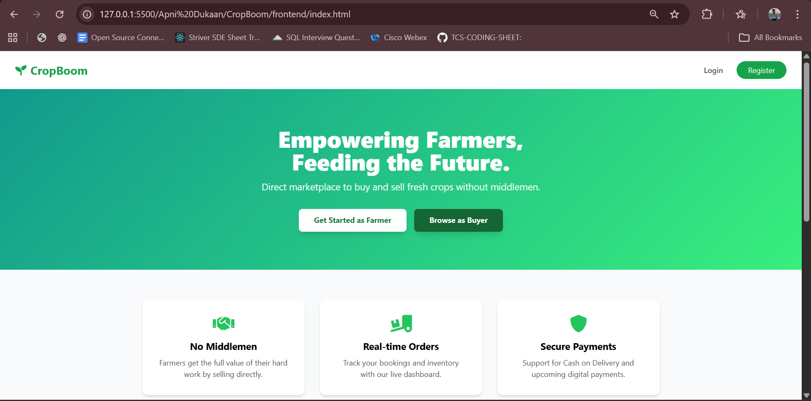
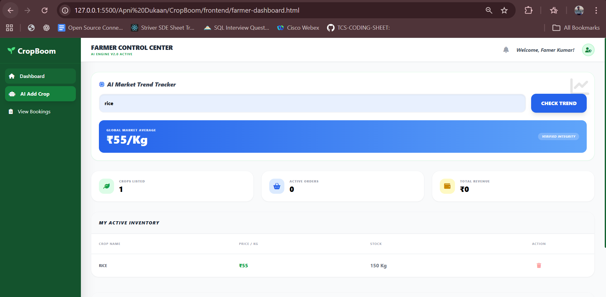
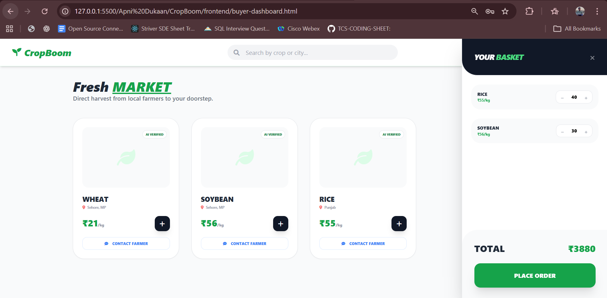

🌾 CropBoom – Smart Farmer Marketplace

CropBoom is a web-based marketplace platform that connects farmers directly with buyers, eliminating middlemen and ensuring fair prices.
Farmers can list their crops, manage inventory, and track orders, while buyers can explore available crops and place bookings easily.

The platform also integrates AI-powered crop image analysis to help farmers automatically identify crops from images and fetch market price trends.

🚀 Features

👨‍🌾 Farmer Features

- AI-based crop image analysis using Google Gemini Vision API

- Add crop listings with price and quantity

- View and manage crop inventory

- Track incoming buyer orders

- Mark orders as delivered

- Receive buyer inquiries

🛒 Buyer Features

- Browse available crops

- Send inquiries to farmers

- Place crop bookings

- View order status

🤖 AI Integration

- Upload crop image

- AI detects crop type

- Automatically fills crop name

- Market price auto-suggested

📊 Dashboard

- Total crops listed

- Active orders

- Total revenue

🛠️ Tech Stack

-> HTML5	Structure

-> Tailwind CSS	UI styling

-> JavaScript (ES6)	Application logic

-> LocalStorage	Data storage

-> Google Gemini API	Crop image analysis

-> Font Awesome	Icons

📂 Project Structure

CropBoom

│
├── index.html

├── login.html

├── register.html

├── farmer-dashboard.html

│

├── css

│   └── dashboard.css

│
├── js

│   └── farmer-dashboard.js

│

└── README.md

⚙️ How to Run the Project

1. Clone the repository

   * git clone https://github.com/27-NakulRathore/CropBoom.git

2. Open the project folder

   * cd CropBoom

3. Open index.html in your browser

    OR run with VS Code Live Server.

4. 🔑 AI Setup (Gemini API)

     * Go to

     https://aistudio.google.com/app/apikey

      * Generate your API key

5.Add it inside:

   * const API_KEY = "YOUR_GEMINI_API_KEY";
   
🧠 How AI Works

1. Farmer uploads crop image

2. Image converted to Base64

3. Image sent to Gemini Vision API

4. Gemini detects crop type

5. Crop name auto-filled in form

6. Market price suggested

## 📸 Screenshots

### Home Page

### Farmer Dashboard

### Buyer Dashboard

